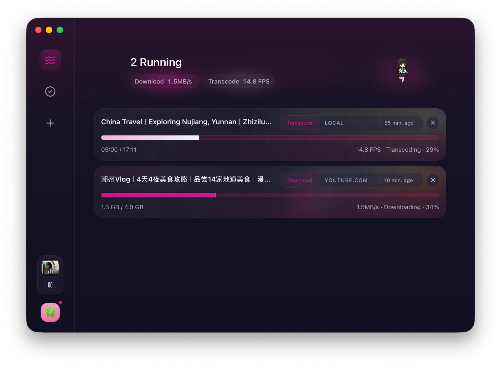
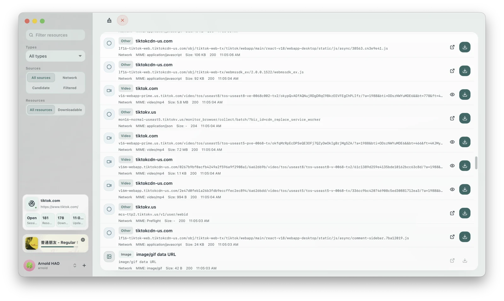
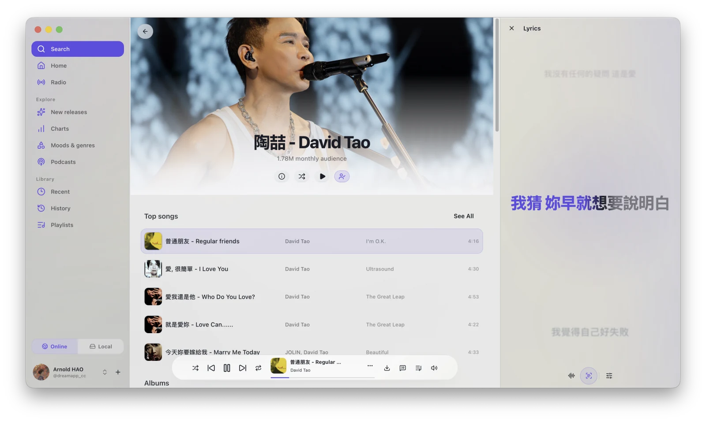
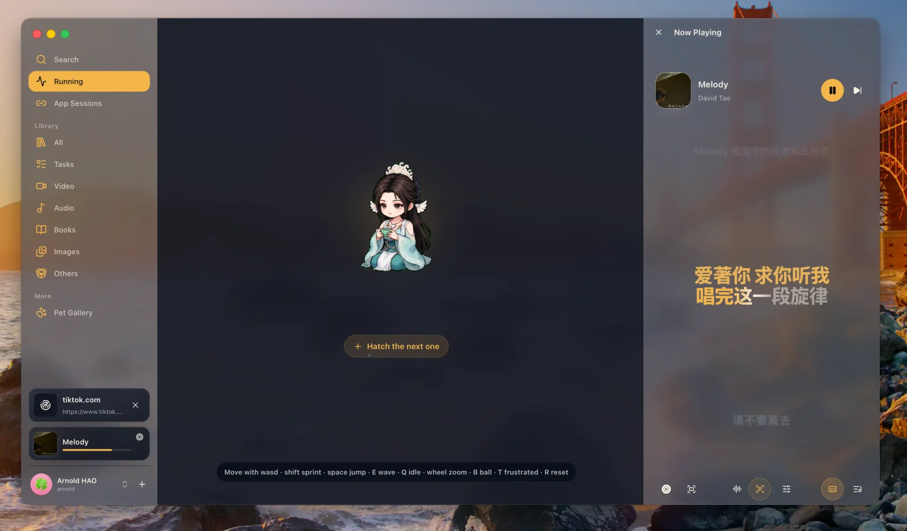
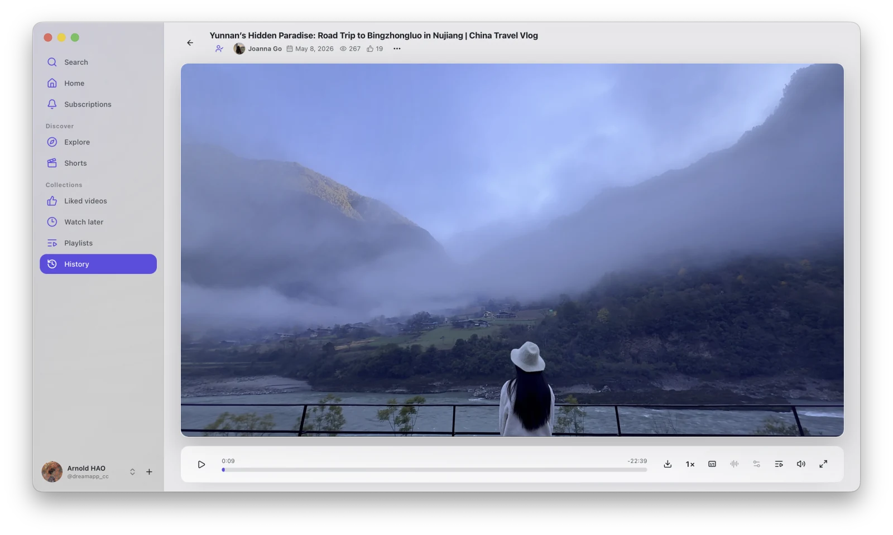
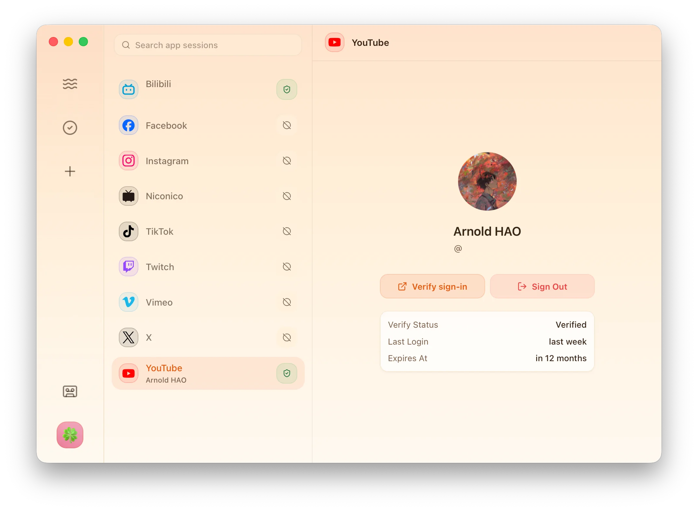
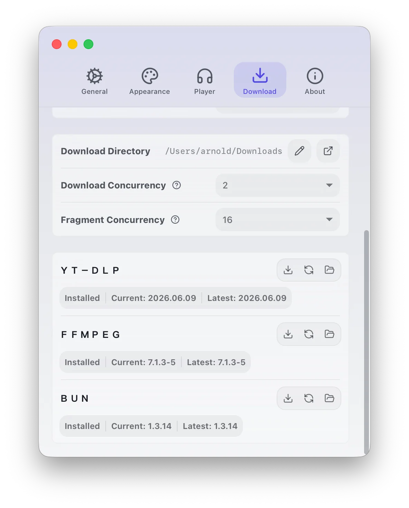
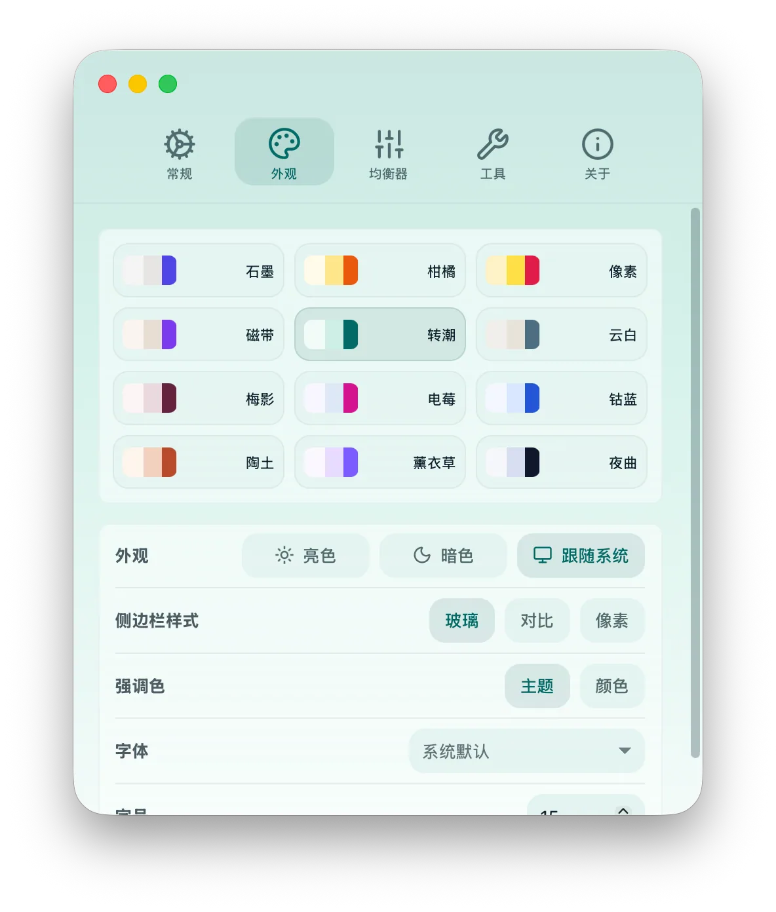
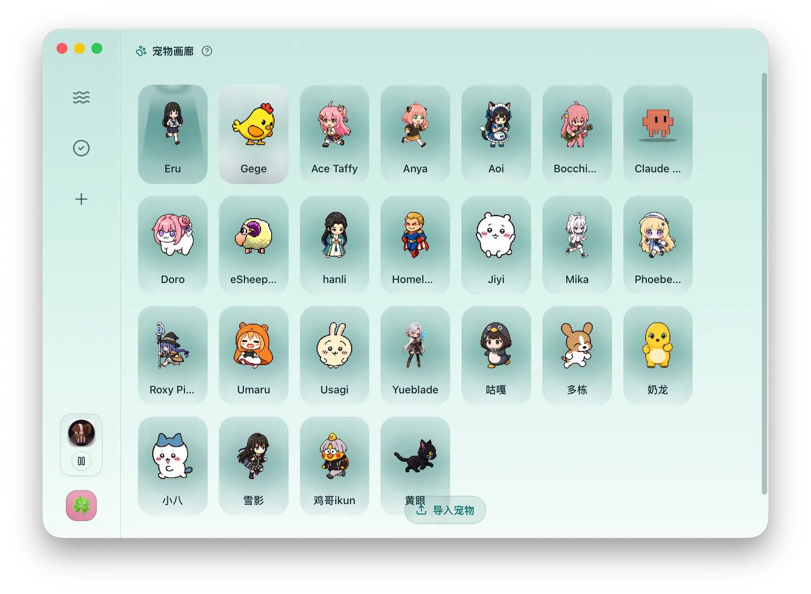

<div align="center">
  
  <h1>下蛋 / XiaDown</h1>
  <p><strong>一款支持在线音乐的双引擎视频下载工具</strong></p>
  <p>Listen Keep, Make it Yours · 随你，听存随心</p>
  <p>
    
    
    
    
  </p>
  <p>
    <a href="https://xiadown.app/">官网</a> ·
    <a href="https://xiadown.app/docs/">使用文档</a> ·
    <a href="https://github.com/arnoldhao/xiadown/releases">发布页</a> ·
    <a href="https://github.com/arnoldhao/xiadown/issues">反馈问题</a> ·
    <a href="https://ko-fi.com/arnoldhao">赞助</a>
  </p>
  <p>
    <strong>简体中文</strong> ·
    <a href="./README_zh-Hant.md">繁體中文</a> ·
    <a href="./README_en.md">English</a> ·
    <a href="./README_ja-JP.md">日本語</a> ·
    <a href="./README_ko-KR.md">한국어</a> ·
    <a href="./README_es-419.md">Español (LatAm)</a> ·
    <a href="./README_pt-BR.md">Português (BR)</a> ·
    <a href="./README_id-ID.md">Bahasa Indonesia</a> ·
    <a href="./README_vi-VN.md">Tiếng Việt</a>
  </p>
</div>

<p align="center">
  
  <br />
  <sub>下载与转码任务</sub>
</p>

## 项目简介

下蛋是一款在线音乐播放器，也是一款支持双引擎下载的视频下载工具。

它是为内容创作者打造的日常工具：需要素材时，用嗅探和 YT-DLP 下载；需要专注时，在后台播放在线音乐；丰富的自定义选项，也让长期使用保持轻松和新鲜。

## 主要能力

### 📥 下载与转码

- **嗅探下载**：基于 CDP 观察网页视频、音频、直播流、清单、图片、字幕和 API 响应；适合 TikTok、抖音、快手、小红书等需要真实浏览器会话的站点。
- **YT-DLP 下载**：粘贴链接即可解析 YouTube、哔哩哔哩等常用平台，保存视频、音频、字幕和封面，并支持使用已登录的身份下载有权访问的内容。
- **音视频转码**：基于 FFmpeg 支持下载后联动转码和本地文件转码，内置 H.264、H.265、VP9、MP3、AAC、Opus、FLAC、WAV 等常用预设。

### 🗂️ 资源管理

- **多视图资源管理**：用任务视图和文件视图统一管理下载、转码、字幕、封面和导入文件，支持预览、详情、批量选择、删除、失败恢复和失效记录清理。

### 🎧 播放器

- **本地音乐播放**：自动索引资源库音频，支持队列、封面、同步歌词、东亚罗马音/拼音歌词、均衡器和频谱可视化。
- **YouTube Music**：桌面化搜索歌曲、艺人和歌单，支持首页推荐、歌单库、关注艺人、喜欢的音乐、播放队列与歌词。
- **YouTube Live**：自定义直播分组与频道，查看直播状态，播放直播电台，也可以直接查看直播视频。

### 🔐 安全隔离

- **依赖自动管理**：自动安装、校验和升级 YT-DLP、FFmpeg、Bun 等工具，路径由应用独立维护，不污染系统环境。
- **凭证与用户隔离**：应用会话数据来自用户主动登录，并在 macOS 与 Windows 上使用系统加密能力独立存储；连接配置与日常浏览器隔离。

### 🎨 自由度

- **外观自由定义**：支持主题包、明暗/自动模式、强调色、字体、字号和侧边栏样式；内置 Codex Pets Gallery，可导入在线与本地 Pets。

## 产品界面

<p align="center">
  
  <br />
  <sub>嗅探台捕获网页资源</sub>
</p>

<p align="center">
  
  <br />
  <sub>YouTube Music 桌面播放</sub>
</p>

<p align="center">
  
  <br />
  <sub>资源库统一管理下载与转码内容</sub>
</p>

<details>
  <summary><strong>更多界面截图</strong></summary>

  <p align="center">
    
    <br />
    <sub>YouTube Live 直播视频查看</sub>
  </p>

  <p align="center">
    
    <br />
    <sub>应用会话、登录校验与账号状态管理</sub>
  </p>

  <p align="center">
    
    <br />
    <sub>下载目录、并发与 YT-DLP、FFmpeg、Bun 依赖管理</sub>
  </p>

  <p align="center">
    
    <br />
    <sub>主题、明暗模式、强调色、字体与字号设置</sub>
  </p>

  <p align="center">
    
    <br />
    <sub>Codex Pets Gallery 与本地宠物导入</sub>
  </p>
</details>

## 安装方式

### Homebrew

macOS 可通过 Homebrew cask 安装：

```bash
brew install --cask arnoldhao/tap/xiadown
```

### 下载安装包

可直接下载最新安装包；历史版本见 [GitHub 发布页](https://github.com/arnoldhao/xiadown/releases)。

| 平台 | 架构 | 形式 | 下载 |
| --- | --- | --- | --- |
| macOS | Apple 芯片 | DMG | [点击下载](https://updates.dreamapp.cc/xiadown/downloads/xiadown-macos-arm64-latest.dmg) |
| macOS | Intel | DMG | [点击下载](https://updates.dreamapp.cc/xiadown/downloads/xiadown-macos-x64-latest.dmg) |
| Windows | x64 | 安装版 | [点击下载](https://updates.dreamapp.cc/xiadown/downloads/xiadown-windows-x64-latest-installer.exe) |
| Windows | x64 | 便携版 | [点击下载](https://updates.dreamapp.cc/xiadown/downloads/xiadown-windows-x64-latest.zip) |

### 首次打开

1. `macOS`：打开 `.dmg`，将 `XiaDown.app` 拖到“应用程序”目录并打开。
2. `Windows`：安装版直接运行 `.exe`；便携版解压后直接启动。若首次启动出现 SmartScreen，选择“更多信息 -> 仍要运行”。
3. 首次启动会进入欢迎引导，完成语言、主题、代理和依赖安装后即可进入主界面。主要流程都集中在欢迎引导和界面内。

### CDP 浏览器支持

当前支持的浏览器：

| 主流 | 隐私与效率 | 特色与区域 |
| --- | --- | --- |
| Chrome、Chromium、Edge | Brave、Vivaldi、Arc、Helium | Opera、Opera GX、Yandex Browser |

## 本地开发

准备好 Go 与 Bun 环境后，安装 Wails 3 命令行并启动开发模式：

```bash
go install github.com/wailsapp/wails/v3/cmd/wails3@v3.0.0-alpha.95
wails3 dev
```

## 免责声明

- 下蛋仅作为媒体管理与下载辅助工具提供，仅供学习、研究以及保存本人有权访问和使用的内容。
- 使用者应自行确认下载、保存、转换和使用相关内容已获得权利人授权，且符合所在地区法律法规和目标网站/平台服务条款。
- 请勿使用下蛋下载、传播、售卖或以其他方式利用侵权、未授权、付费受限、隐私或其他违法违规内容。
- 因使用下蛋产生的版权、平台规则、账号、网络或其他法律责任由使用者自行承担；项目维护者不对使用者行为及其后果负责。

## 感谢

下蛋建立在一系列优秀的开源项目之上。桌面体验、媒体处理、本地存储、浏览器连接、在线音乐与界面能力，都离不开这些依赖的支持。

| 分类 | 项目主页 |
| --- | --- |
| 桌面框架 | <a href="https://go.dev/" target="_blank" rel="noreferrer">Go</a> / <a href="https://v3alpha.wails.io/" target="_blank" rel="noreferrer">Wails 3</a> / <a href="https://react.dev/" target="_blank" rel="noreferrer">React</a> |
| 媒体处理 | <a href="https://github.com/yt-dlp/yt-dlp" target="_blank" rel="noreferrer">yt-dlp</a> / <a href="https://ffmpeg.org/" target="_blank" rel="noreferrer">FFmpeg</a> |
| 本地存储 | <a href="https://www.sqlite.org/" target="_blank" rel="noreferrer">SQLite</a> / <a href="https://bun.uptrace.dev/" target="_blank" rel="noreferrer">Bun ORM</a> |
| 浏览器连接 | <a href="https://chromedevtools.github.io/devtools-protocol/" target="_blank" rel="noreferrer">Chrome DevTools Protocol</a> / <a href="https://github.com/chromedp/chromedp" target="_blank" rel="noreferrer">chromedp</a> |
| 前端体验 | <a href="https://bun.sh/" target="_blank" rel="noreferrer">Bun</a> / <a href="https://vite.dev/" target="_blank" rel="noreferrer">Vite</a> / <a href="https://lucide.dev/" target="_blank" rel="noreferrer">Lucide</a> / <a href="https://www.radix-ui.com/" target="_blank" rel="noreferrer">Radix UI</a> |

## 协作

- 项目正在持续演进，当前暂不接受 PR，欢迎通过 [GitHub Issues](https://github.com/arnoldhao/xiadown/issues) 或邮件反馈问题、分享建议与使用场景。
- 仓库采用 `Apache-2.0` 许可证，详见 [LICENSE](./LICENSE)。

## 联系

- 官网：<https://xiadown.app/>
- 使用文档：<https://xiadown.app/docs/>
- 邮箱：<xunruhao@gmail.com>
