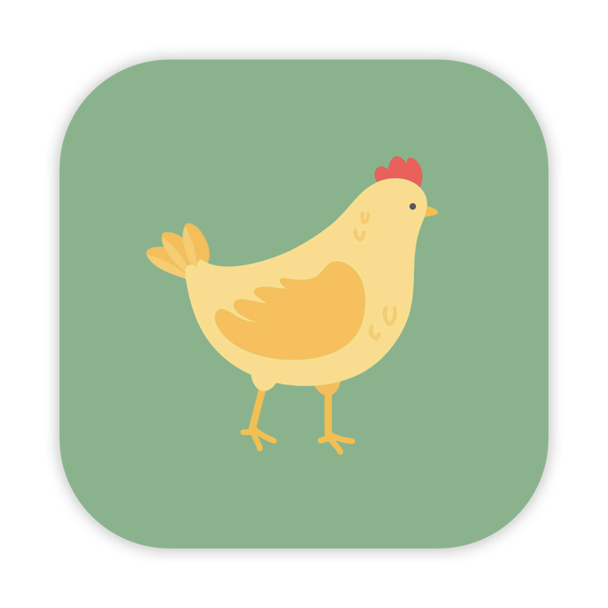
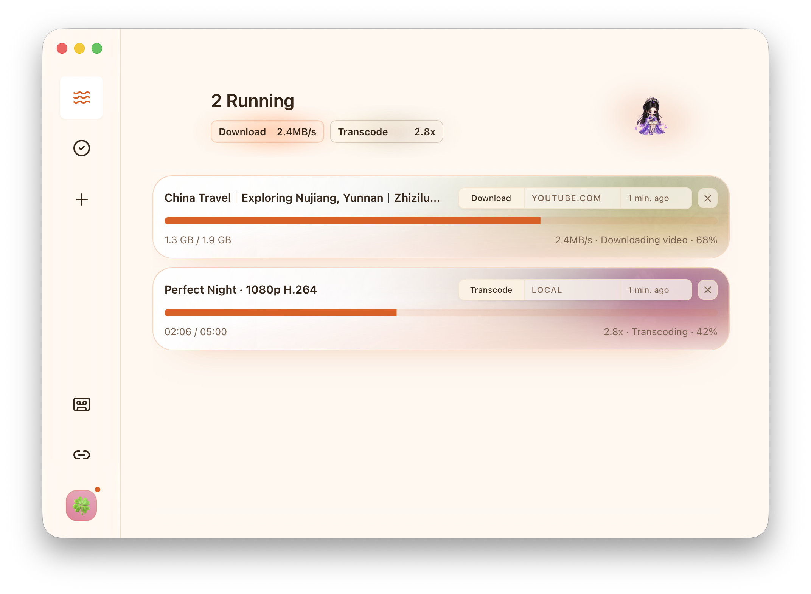
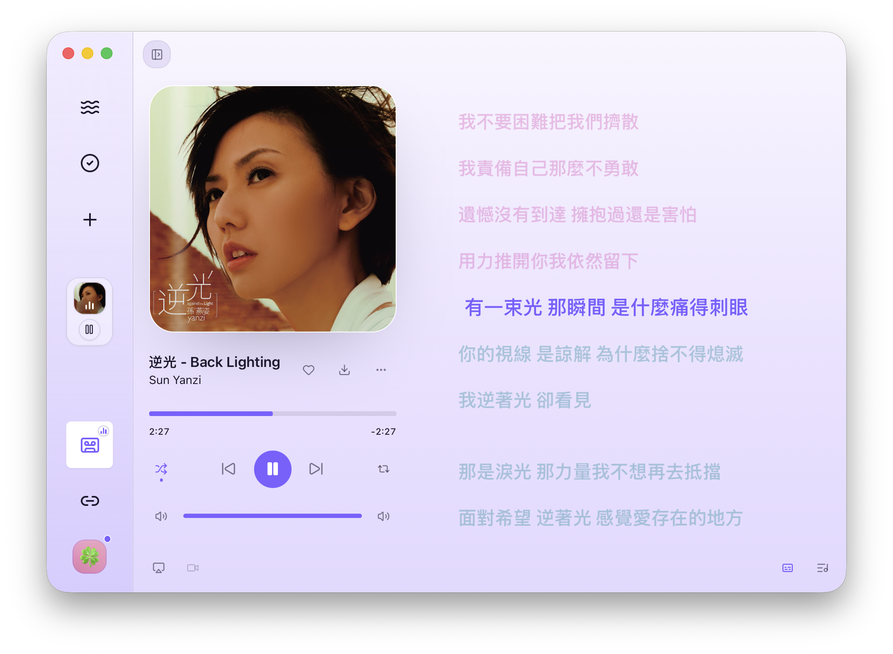
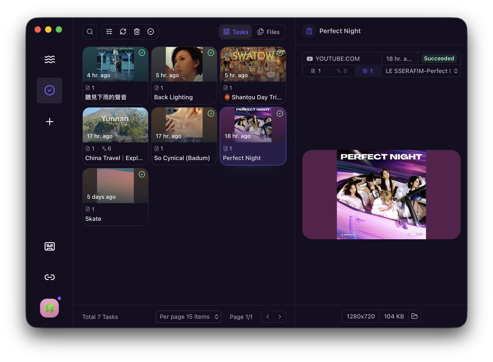

  
  <h1>XiaDown</h1>
  
<strong>A video download tool with online music support.</strong>

  
Listen Keep, Make it Yours

  

    <a href="./README.md">简体中文</a> ·
    <strong>English</strong>
  

  

    
    
    
    
  

## Overview

XiaDown is an online music player, and also a video download tool.

It is built for content creators: when you need source material, it provides powerful YT-DLP-based download capabilities; when you need to work, it can keep online music playing in the background. With sprites and customizable appearance, the app stays simple without feeling dull.

## Core Capabilities

- **Online music playback**: YouTube Lo-Fi stations and YouTube Music in one place, with account sign-in, song/artist/playlist search, playback queues, lyrics, covers, and download handoff for tracks you want to keep.
- **Video and audio downloads**: powered by YT-DLP, with support for material downloads from thousands of online video sites; paste a link to save video, audio, subtitles, and covers, then transcode and manage them in the local library.
- **Personalized media space**: theme packs, accent colors, appearance modes, sidebar styles, sprites, and connections, with dependencies and updates maintained automatically for long-term daily use.

## Product Preview

  

  

  

## Quick Start

### Download and install

Download the latest installer directly below. Older releases are available on [GitHub Releases](https://github.com/arnoldhao/xiadown/releases).

| Platform | Architecture | Package | Download |
| --- | --- | --- | --- |
| macOS | Apple Silicon | Archive | [Download](https://updates.dreamapp.cc/xiadown/downloads/xiadown-macos-arm64-latest.zip) |
| macOS | Intel | Archive | [Download](https://updates.dreamapp.cc/xiadown/downloads/xiadown-macos-x64-latest.zip) |
| Windows | x64 | Installer | [Download](https://updates.dreamapp.cc/xiadown/downloads/xiadown-windows-x64-latest-installer.exe) |
| Windows | x64 | Portable | [Download](https://updates.dreamapp.cc/xiadown/downloads/xiadown-windows-x64-latest.zip) |

### First launch

1. `macOS`: unzip the package and move `XiaDown.app` to the Applications folder. If macOS says the app cannot be opened or is damaged, run `sudo xattr -rd com.apple.quarantine /Applications/XiaDown.app`.
2. `Windows`: run the `.exe` installer directly, or unzip the portable package and launch it. If SmartScreen appears on first launch, choose `More info -> Run anyway`.
3. XiaDown opens an onboarding flow for language, theme, proxy, and dependency setup. The main workflows are in the onboarding flow and UI.

## Acknowledgements

XiaDown is built on top of excellent open-source projects. The desktop experience, media pipeline, local storage, browser connections, online music, and frontend interface all depend on these foundations.

| Category | Homepage |
| --- | --- |
| Desktop Framework | <a href="https://go.dev/" target="_blank" rel="noreferrer">Go</a> / <a href="https://v3alpha.wails.io/" target="_blank" rel="noreferrer">Wails 3</a> / <a href="https://react.dev/" target="_blank" rel="noreferrer">React</a> |
| Media Processing | <a href="https://github.com/yt-dlp/yt-dlp" target="_blank" rel="noreferrer">yt-dlp</a> / <a href="https://ffmpeg.org/" target="_blank" rel="noreferrer">FFmpeg</a> |
| Local Storage | <a href="https://www.sqlite.org/" target="_blank" rel="noreferrer">SQLite</a> / <a href="https://bun.uptrace.dev/" target="_blank" rel="noreferrer">Bun ORM</a> |
| Browser Connections | <a href="https://chromedevtools.github.io/devtools-protocol/" target="_blank" rel="noreferrer">Chrome DevTools Protocol</a> / <a href="https://github.com/chromedp/chromedp" target="_blank" rel="noreferrer">chromedp</a> |
| Frontend Experience | <a href="https://bun.sh/" target="_blank" rel="noreferrer">Bun</a> / <a href="https://vite.dev/" target="_blank" rel="noreferrer">Vite</a> / <a href="https://lucide.dev/" target="_blank" rel="noreferrer">Lucide</a> / <a href="https://www.radix-ui.com/" target="_blank" rel="noreferrer">Radix UI</a> |

## Collaboration

- The project is under active development and is not accepting pull requests for now. Feedback, bug reports, and usage scenarios are welcome through [GitHub Issues](https://github.com/arnoldhao/xiadown/issues) or email.
- This repository is licensed under `Apache-2.0`. See [LICENSE](./LICENSE).

## Contact

- Website: <https://xiadown.dreamapp.cc/>
- Email: <xunruhao@gmail.com>
