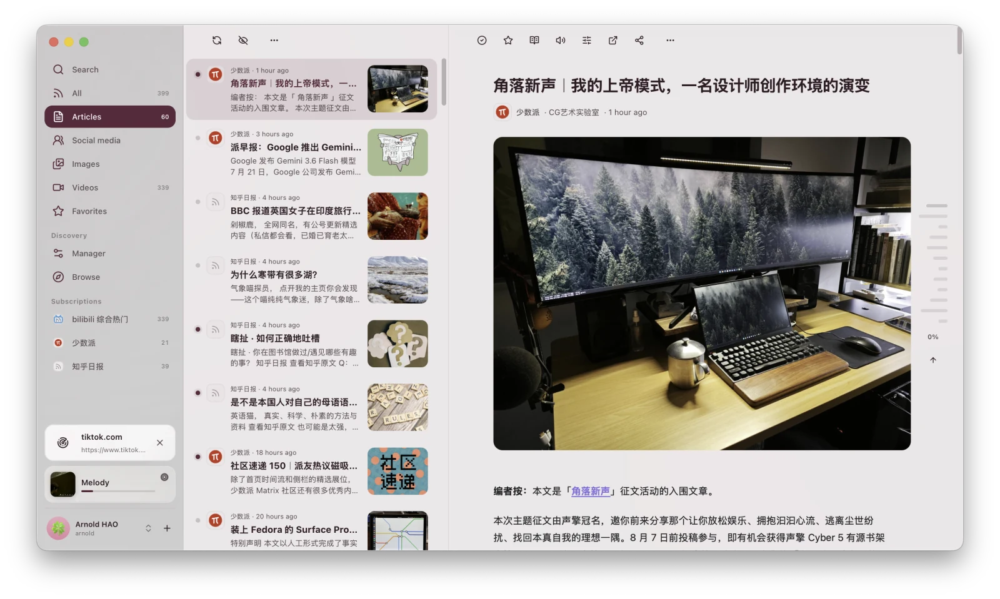

<div align="center">
  
  <h1>XiaDown</h1>
  <p><strong>動画ダウンロードに対応したメディアライブラリ管理アプリ</strong></p>
  <p>
    
    
    
    
  </p>
  <p>
    <a href="https://xiadown.app/">公式サイト</a> ·
    <a href="https://xiadown.app/docs/">ドキュメント</a> ·
    <a href="https://github.com/arnoldhao/xiadown/releases">リリース</a> ·
    <a href="https://github.com/arnoldhao/xiadown/issues">問題を報告</a> ·
    <a href="https://ko-fi.com/arnoldhao">スポンサー</a>
  </p>
  <p>
    <a href="./README.md">简体中文</a> ·
    <a href="./README_zh-Hant.md">繁體中文</a> ·
    <a href="./README_en.md">English</a> ·
    <strong>日本語</strong> ·
    <a href="./README_ko-KR.md">한국어</a> ·
    <a href="./README_es-419.md">Español (LatAm)</a> ·
    <a href="./README_pt-BR.md">Português (BR)</a> ·
    <a href="./README_id-ID.md">Bahasa Indonesia</a> ·
    <a href="./README_vi-VN.md">Tiếng Việt</a>
  </p>
</div>

<p align="center">
  <a href="https://xiadown.app/docs/library/">
    
  </a>
  <br />
  <strong>ライブラリ</strong>
</p>

## プロジェクト概要

XiaDown はローカルファーストのメディアライブラリ管理アプリで、動画ダウンロードとメディアスニッフィングに対応しています。YouTube、YouTube Music、RSS クライアントとしても使え、コンテンツの閲覧中に必要なメディアをワンクリックでダウンロードできます。

## 主な機能

- 🗂️ **[ライブラリ](https://xiadown.app/docs/library/)** — 動画のダウンロード、トランスコード、ライブラリ管理。
- 🔎 **[スニッフィング](https://xiadown.app/docs/sniff/)** — Web ページ内のメディアを検出してダウンロード。
- 🎵 **[音楽](https://xiadown.app/docs/music/)** — YouTube Music の閲覧とダウンロード、ローカル音楽の再生。
- ▶️ **[YouTube](https://xiadown.app/docs/youtube/)** — 動画の閲覧、再生、ダウンロード。
- 📡 **[RSS](https://xiadown.app/docs/rss/)** — コンテンツの購読、閲覧、メディアのダウンロード。

## モバイル版

📱 iPhone・iPad クライアントを開発中です。

## 製品画面

<table>
  <tr>
    <td align="center" width="50%">
      <a href="https://xiadown.app/docs/sniff/">
        
      </a>
      <br />
      <strong>スニッフィング</strong>
    </td>
    <td align="center" width="50%">
      <a href="https://xiadown.app/docs/rss/">
        
      </a>
      <br />
      <strong>RSS</strong>
    </td>
  </tr>
  <tr>
    <td align="center" width="50%">
      <a href="https://xiadown.app/docs/music/">
        
      </a>
      <br />
      <strong>音楽</strong>
    </td>
    <td align="center" width="50%">
      <a href="https://xiadown.app/docs/youtube/">
        
      </a>
      <br />
      <strong>YouTube</strong>
    </td>
  </tr>
</table>

## インストール

### Homebrew

macOS では Homebrew cask からインストールできます：

```bash
brew install --cask arnoldhao/tap/xiadown
```

### インストーラーをダウンロード

| プラットフォーム | アーキテクチャ | 形式 | ダウンロード |
| --- | --- | --- | --- |
| macOS | Apple シリコン | DMG | [ダウンロード](https://updates.dreamapp.cc/xiadown/downloads/xiadown-macos-arm64-latest.dmg) |
| macOS | Intel | DMG | [ダウンロード](https://updates.dreamapp.cc/xiadown/downloads/xiadown-macos-x64-latest.dmg) |
| Windows | x64 | インストーラー | [ダウンロード](https://updates.dreamapp.cc/xiadown/downloads/xiadown-windows-x64-latest-installer.exe) |
| Windows | x64 | ポータブル版 | [ダウンロード](https://updates.dreamapp.cc/xiadown/downloads/xiadown-windows-x64-latest.zip) |

> macOS 版には macOS 14（Sonoma）以降、Windows 版には Windows 10 以降が必要です。

初回起動時に、言語、外観、ネットワーク、実行に必要な依存ツールを設定するガイドが表示されます。詳しい手順は[インストールと初回起動](https://xiadown.app/docs/start/install/)をご覧ください。

## ローカル開発

開発環境には Go 1.25.12、Node.js 24、Bun 1.3.5、Wails 3 alpha2.117 が必要です：

```bash
go install github.com/wailsapp/wails/v3/cmd/wails3@v3.0.0-alpha2.117
wails3 task dev
```

その他のビルド・チェックタスクは [Taskfile.yml](./Taskfile.yml) をご覧ください。

## 免責事項

- XiaDown は、メディアの管理と、利用者本人がアクセス・使用する権利を持つコンテンツの保存にのみ使用してください。
- コンテンツのダウンロード、保存、変換、使用が、居住地域の法令、権利者の許諾、対象プラットフォームの利用規約に適合することを、利用者自身の責任で確認してください。
- 権利侵害、無許諾、有料・アクセス制限付き、プライバシーに関わる、その他違法または不適切なコンテンツの処理に XiaDown を使用しないでください。
- XiaDown の使用に伴う著作権、プラットフォーム規約、アカウント、ネットワーク、その他の責任は利用者が負うものとします。

## 謝辞

XiaDown は [Go](https://go.dev/)、[Wails](https://v3alpha.wails.io/)、[React](https://react.dev/)、[yt-dlp](https://github.com/yt-dlp/yt-dlp)、[FFmpeg](https://ffmpeg.org/)、[SQLite](https://www.sqlite.org/) などのオープンソースプロジェクトを利用しています。依存関係とライセンスについては [THIRD_PARTY_NOTICES.txt](./frontend/public/THIRD_PARTY_NOTICES.txt) をご覧ください。

## コラボレーション

- 現在、このプロジェクトでは PR を受け付けていません。問題や提案は [GitHub Issues](https://github.com/arnoldhao/xiadown/issues) へお寄せください。
- このリポジトリは `Apache-2.0` ライセンスで提供されています。詳しくは [LICENSE](./LICENSE) をご覧ください。

## 連絡先

- 公式サイト：<https://xiadown.app/>
- ドキュメント：<https://xiadown.app/docs/>
- メール：<xunruhao@gmail.com>
