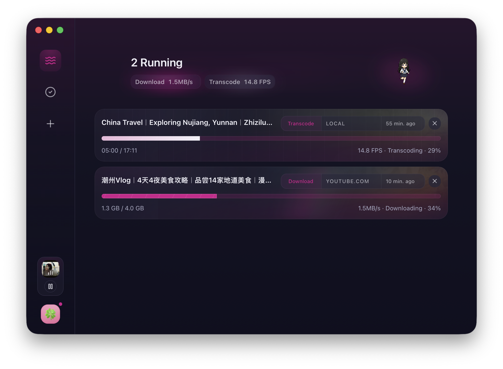
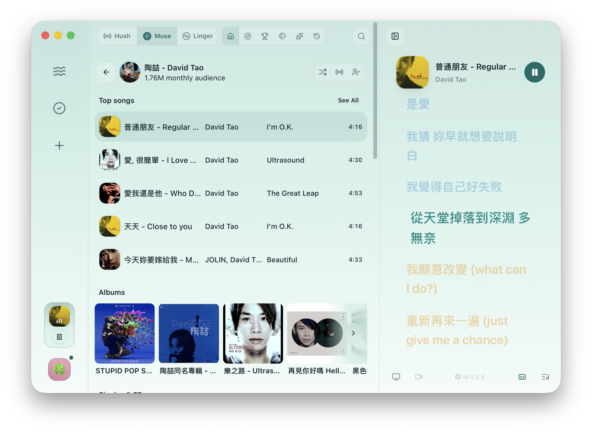
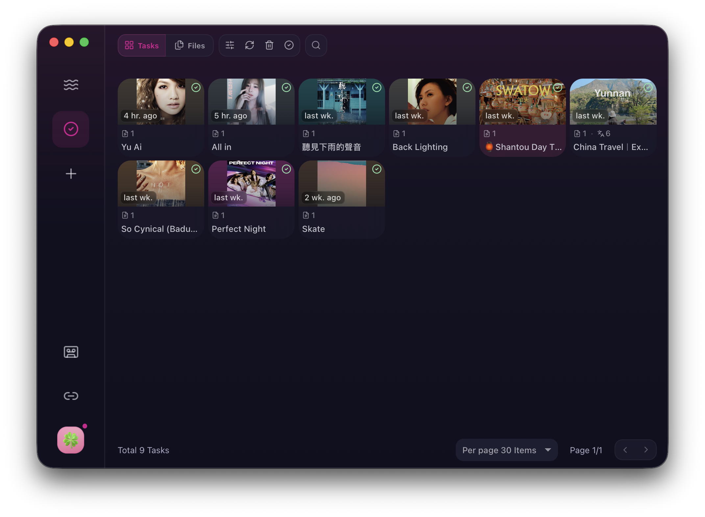

  
  <h1>XiaDown</h1>
  
<strong>온라인 음악을 지원하는 동영상 다운로드 도구입니다.</strong>

  
Listen Keep, Make it Yours

  

    <a href="./README.md">简体中文</a> ·
    <a href="./README_zh-Hant.md">繁體中文</a> ·
    <a href="./README_en.md">English</a> ·
    <a href="./README_ja-JP.md">日本語</a> ·
    <strong>한국어</strong> ·
    <a href="./README_es-419.md">Español (LatAm)</a> ·
    <a href="./README_pt-BR.md">Português (BR)</a> ·
    <a href="./README_id-ID.md">Bahasa Indonesia</a> ·
    <a href="./README_vi-VN.md">Tiếng Việt</a>
  

  

    
    
    
    
  

## 개요

XiaDown은 온라인 음악 플레이어이자 동영상 다운로드 도구입니다.

콘텐츠 크리에이터를 위해 만들어졌습니다. 자료가 필요할 때는 YT-DLP 기반의 강력한 다운로드 기능을 제공하고, 작업할 때는 온라인 음악을 백그라운드에서 재생합니다. 펫과 사용자 지정 외관을 통해 앱은 단순하면서도 지루하지 않게 유지됩니다.

## 주요 기능

- **온라인 음악 플레이어**: YouTube Lo-Fi 스테이션과 YouTube Music을 위해 설계된 데스크톱 플레이어입니다. 계정 로그인, 곡, 아티스트, 플레이리스트 검색, 재생 대기열, 가사, 아트워크 표시를 지원하며 사용자 지정 온라인 Lo-Fi 스테이션도 추가할 수 있습니다. 오래 보관하고 싶은 트랙은 로컬 라이브러리에 다운로드할 수 있습니다.
- **동영상 및 오디오 다운로드**: YT-DLP 기반으로 수천 개의 온라인 동영상 사이트에서 자료를 다운로드할 수 있습니다. 링크를 붙여 넣으면 동영상, 오디오, 자막, 커버를 저장하고, 이후 트랜스코딩하여 로컬 라이브러리에서 관리할 수 있습니다.
- **개인화된 미디어 공간**: 세심하게 설계된 테마 팩, 강조 색상, 외관 모드, 사이드바 스타일, Codex Pets 전체 지원을 제공합니다. 의존성과 앱 업데이트는 자동으로 유지되어 장기간 매일 사용하는 미디어 도구로 적합합니다.

## 제품 미리보기

  

  

  

## 빠른 시작

### 다운로드 및 설치

아래에서 최신 설치 패키지를 바로 다운로드할 수 있습니다. 이전 버전은 [GitHub Releases](https://github.com/arnoldhao/xiadown/releases)에서 확인할 수 있습니다.

| 플랫폼 | 아키텍처 | 패키지 | 다운로드 |
| --- | --- | --- | --- |
| macOS | Apple Silicon | 압축 파일 | [다운로드](https://updates.dreamapp.cc/xiadown/downloads/xiadown-macos-arm64-latest.zip) |
| macOS | Intel | 압축 파일 | [다운로드](https://updates.dreamapp.cc/xiadown/downloads/xiadown-macos-x64-latest.zip) |
| Windows | x64 | 설치 프로그램 | [다운로드](https://updates.dreamapp.cc/xiadown/downloads/xiadown-windows-x64-latest-installer.exe) |
| Windows | x64 | 포터블 | [다운로드](https://updates.dreamapp.cc/xiadown/downloads/xiadown-windows-x64-latest.zip) |

### 처음 실행

1. `macOS`: 패키지를 압축 해제한 뒤 `XiaDown.app`을 응용 프로그램 폴더로 이동합니다. macOS에서 앱을 열 수 없거나 손상되었다고 표시되면 터미널에서 `sudo xattr -rd com.apple.quarantine /Applications/XiaDown.app`을 실행하세요.
2. `Windows`: `.exe` 설치 프로그램을 직접 실행하거나 포터블 패키지를 압축 해제한 뒤 실행합니다. 처음 실행할 때 SmartScreen이 나타나면 `추가 정보 -> 실행`을 선택하세요.
3. XiaDown은 언어, 테마, 프록시, 의존성 설정을 위한 온보딩 흐름을 엽니다. 주요 작업 흐름은 온보딩과 앱 UI에 모여 있습니다.

## 면책 조항

- XiaDown은 미디어 관리 및 다운로드 보조 도구로 제공되며, 학습, 연구, 그리고 사용자가 접근 및 사용할 권한이 있는 콘텐츠를 저장하기 위한 용도입니다.
- 콘텐츠의 다운로드, 저장, 변환, 사용이 권리자의 허가를 받았고 적용되는 법률 및 대상 사이트/플랫폼의 서비스 약관을 준수하는지 확인할 책임은 사용자에게 있습니다.
- 침해 콘텐츠, 무단 콘텐츠, 유료 또는 제한 콘텐츠, 개인정보와 관련된 콘텐츠, 기타 불법 콘텐츠를 다운로드, 배포, 판매하거나 이용하기 위해 XiaDown을 사용하지 마세요.
- XiaDown 사용으로 발생하는 저작권, 플랫폼 정책, 계정, 네트워크 또는 기타 법적 책임은 사용자 본인에게 있으며, 프로젝트 관리자는 사용자의 행위와 그 결과에 책임을 지지 않습니다.

## 감사의 글

XiaDown은 훌륭한 오픈 소스 프로젝트 위에 만들어졌습니다. 데스크톱 경험, 미디어 처리, 로컬 저장소, 브라우저 연결, 온라인 음악, 프론트엔드 인터페이스는 모두 이러한 기반에 의존합니다.

| 분류 | 홈페이지 |
| --- | --- |
| 데스크톱 프레임워크 | <a href="https://go.dev/" target="_blank" rel="noreferrer">Go</a> / <a href="https://v3alpha.wails.io/" target="_blank" rel="noreferrer">Wails 3</a> / <a href="https://react.dev/" target="_blank" rel="noreferrer">React</a> |
| 미디어 처리 | <a href="https://github.com/yt-dlp/yt-dlp" target="_blank" rel="noreferrer">yt-dlp</a> / <a href="https://ffmpeg.org/" target="_blank" rel="noreferrer">FFmpeg</a> |
| 로컬 저장소 | <a href="https://www.sqlite.org/" target="_blank" rel="noreferrer">SQLite</a> / <a href="https://bun.uptrace.dev/" target="_blank" rel="noreferrer">Bun ORM</a> |
| 브라우저 연결 | <a href="https://chromedevtools.github.io/devtools-protocol/" target="_blank" rel="noreferrer">Chrome DevTools Protocol</a> / <a href="https://github.com/chromedp/chromedp" target="_blank" rel="noreferrer">chromedp</a> |
| 프론트엔드 경험 | <a href="https://bun.sh/" target="_blank" rel="noreferrer">Bun</a> / <a href="https://vite.dev/" target="_blank" rel="noreferrer">Vite</a> / <a href="https://lucide.dev/" target="_blank" rel="noreferrer">Lucide</a> / <a href="https://www.radix-ui.com/" target="_blank" rel="noreferrer">Radix UI</a> |

## 협업

- 이 프로젝트는 계속 개발 중이며 현재 pull request는 받지 않습니다. 피드백, 버그 제보, 사용 사례는 [GitHub Issues](https://github.com/arnoldhao/xiadown/issues) 또는 이메일로 환영합니다.
- 이 저장소는 `Apache-2.0` 라이선스를 따릅니다. 자세한 내용은 [LICENSE](./LICENSE)를 참고하세요.

## 연락처

- 웹사이트: <https://xiadown.dreamapp.cc/>
- 이메일: <xunruhao@gmail.com>
