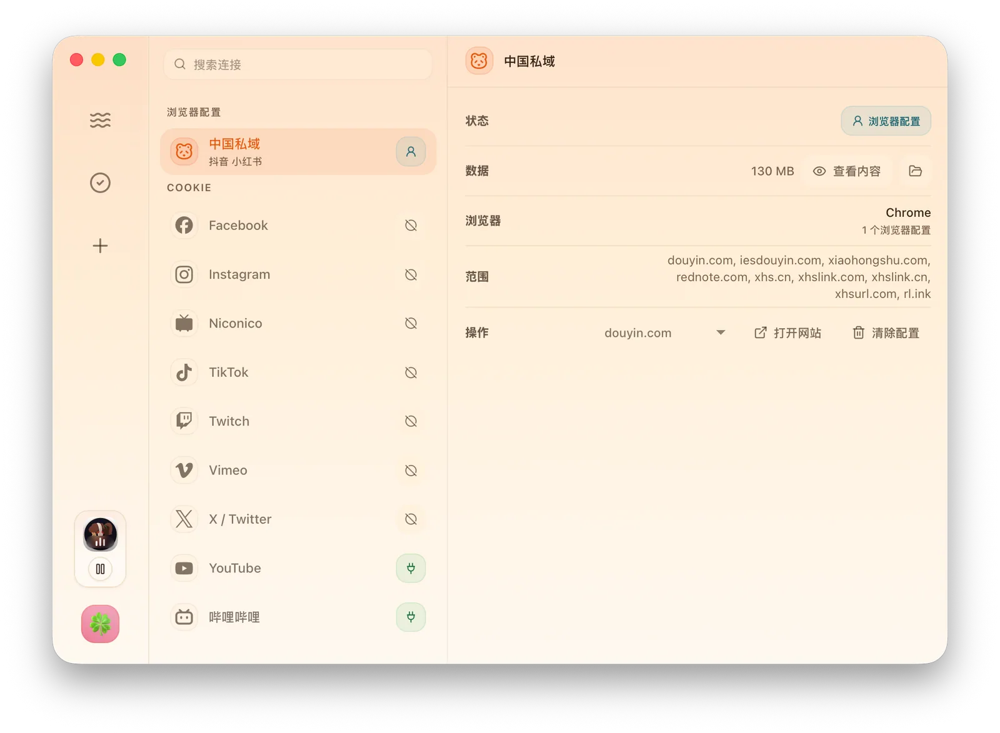
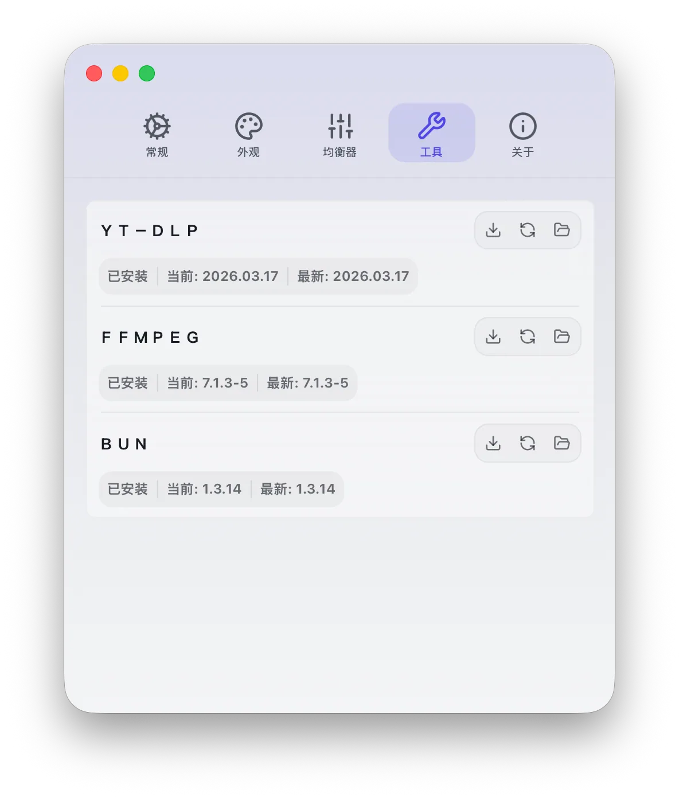

  
  <h1>下蛋 / XiaDown</h1>
  
<strong>一款支援線上音樂的雙引擎影片下載工具</strong>

  
Listen Keep, Make it Yours · 隨你，聽存隨心

  

    <a href="./README.md">簡體中文</a> ·
    <strong>繁體中文</strong> ·
    <a href="./README_en.md">English</a> ·
    <a href="./README_ja-JP.md">日本語</a> ·
    <a href="./README_ko-KR.md">한국어</a> ·
    <a href="./README_es-419.md">Español (LatAm)</a> ·
    <a href="./README_pt-BR.md">Português (BR)</a> ·
    <a href="./README_id-ID.md">Bahasa Indonesia</a> ·
    <a href="./README_vi-VN.md">Tiếng Việt</a>
  

  

    
    
    
    
  

## 專案簡介

下蛋是一款線上音樂播放器，也是一款支援雙引擎下載的影片下載工具。

它是為內容創作者打造的：需要素材時，提供嗅探與 YT-DLP 的強大下載能力；需要工作時，在背景提供線上音樂播放能力。同時依託資源庫、轉檔、依賴自動管理、帳號隔離、寵物與自訂外觀，讓下蛋既能處理素材，也能長期作為自己的桌面媒體工具使用。

## 主要能力

- 📥 **雙引擎影片下載**：內建 YT-DLP 下載引擎，也提供基於 CDP 的瀏覽器嗅探引擎。一般連結可直接解析下載，並可結合連線中儲存的 Cookies；遇到動態載入、站點結構複雜或需要真實瀏覽器工作階段的資源，可透過嗅探模式捕獲影片、音訊、字幕、封面和其他媒體資源，下載後還能繼續轉檔並進入資源庫管理。
- 🎧 **桌面音樂播放器**：自動管理下載資源中的本機音訊，也支援 YouTube Music 搜尋歌曲、藝人和歌單，以及 YouTube Live 直播電台播放與直播影片查看。播放器支援佇列、封面、同步歌詞、東亞羅馬音/拼音歌詞、等化器和頻譜視覺化。
- 🧩 **自由且可控的使用空間**：依賴工具由應用程式自動安裝和升級，不污染系統環境；帳號、Cookies 與瀏覽器 Profile 使用獨立連線設定管理；佈景主題、明暗模式、強調色、字型、字號和 Codex Pets 都可以自由調整。

## 核心能力

- **嗅探下載**：自主研發基於 CDP 的瀏覽器嗅探能力，可觀察網頁中的影片、音訊、直播流、清單、圖片、字幕、API 回應等資源；支援在使用者主動登入後的真實瀏覽器環境中識別與下載 TikTok、抖音、快手、小紅書等站點資源，也可與轉檔聯動，下載完成後自動進入轉檔流程。
- **YT-DLP 下載**：整合 YT-DLP 下載能力，支援大量線上影片網站的素材下載，可穩定下載 YouTube、嗶哩嗶哩等常用平台資源；貼上連結即可解析並儲存影片、音訊、字幕和封面，也可攜帶連線中儲存的 Cookies 下載使用者有權存取的內容，下載後可繼續轉檔並在資源庫裡統一管理。
- **音影片轉檔**：基於 FFmpeg，支援下載後聯動轉檔和手動選擇本機檔案轉檔；內建 H.264、H.265、VP9、MP3、AAC、Opus、FLAC、WAV 等常用預設，覆蓋原始尺寸、2160p、1080p、720p、480p 等輸出場景。
- **多視圖資源管理**：支援任務視圖與檔案視圖，統一管理下載、轉檔、字幕、封面和匯入檔案；支援媒體預覽、任務詳情、檔案詳情、批次選擇、刪除、失敗任務恢復、檔案存在性檢查與失效記錄清理。
- **本機音樂播放**：自動索引資源庫中的音訊檔案，支援本機播放、播放佇列、封面顯示、同步歌詞、東亞羅馬音/拼音歌詞、等化器和多種頻譜視覺化效果。
- **YouTube Music**：提供桌面化 YouTube Music 播放體驗，支援帳號連線、歌曲/藝人/歌單搜尋、首頁推薦、歌單庫、關注藝人、喜歡的音樂、播放佇列與歌詞，並透過廣告資料清理減少播放干擾。
- **YouTube Live**：支援自訂新增 YouTube Live 分組與頻道，可查看直播狀態、播放直播電台，也可以直接查看直播影片。
- **依賴自動管理**：自動維護 YT-DLP、FFmpeg、Bun 等工具的安裝、校驗與升級；工具路徑由應用程式獨立管理，不依賴也不污染使用者本機全域環境。
- **憑證與使用者隔離**：支援透過 CDP 呼叫本機瀏覽器能力並持久化獨立的 Profiles 與 Cookies；資料僅來自使用者主動登入，連線設定與日常瀏覽器使用場景相互隔離。
- **外觀自由定義**：支援佈景主題包、明暗/自動模式、強調色、字型、字號、側邊欄樣式等外觀設定；內建 Codex Pets Gallery，可匯入線上與本機 Pets 並設定為桌面陪伴元素。

## 產品介面

  
   
  下載與轉檔任務

  
   
  嗅探台捕獲網頁資源

  
   
  YouTube Music 桌面播放

  
   
  YouTube Live 直播影片查看

  
   
  資源庫統一管理下載與轉檔內容

  
更多設定與個人化介面

  

    
     
    連線設定、Cookies 與瀏覽器 Profile 隔離
  

  

    
     
    YT-DLP、FFmpeg、Bun 依賴自動管理
  

  

    
     
    佈景主題、明暗模式、強調色、字型與字號設定
  

  

    
     
    Codex Pets Gallery 與本機寵物匯入
  

## 快速開始

### 下載安裝

可直接下載最新安裝包；歷史版本見 [GitHub 發布頁](https://github.com/arnoldhao/xiadown/releases)。

| 平台 | 架構 | 形式 | 下載 |
| --- | --- | --- | --- |
| macOS | Apple 晶片 | 壓縮檔 | [點擊下載](https://updates.dreamapp.cc/xiadown/downloads/xiadown-macos-arm64-latest.zip) |
| macOS | Intel | 壓縮檔 | [點擊下載](https://updates.dreamapp.cc/xiadown/downloads/xiadown-macos-x64-latest.zip) |
| Windows | x64 | 安裝版 | [點擊下載](https://updates.dreamapp.cc/xiadown/downloads/xiadown-windows-x64-latest-installer.exe) |
| Windows | x64 | 可攜版 | [點擊下載](https://updates.dreamapp.cc/xiadown/downloads/xiadown-windows-x64-latest.zip) |

### 首次開啟

1. `macOS`：解壓縮後將 `XiaDown.app` 移動到「應用程式」目錄。若系統提示「無法打開」或「已損毀」，請在終端機執行 `sudo xattr -rd com.apple.quarantine /Applications/XiaDown.app`。
2. `Windows`：安裝版直接執行 `.exe`；可攜版解壓縮後直接啟動。若首次啟動出現 SmartScreen，選擇「更多資訊 -> 仍要執行」。
3. 首次啟動會進入歡迎引導，完成語言、佈景主題、代理和依賴安裝後即可進入主介面。主要流程都集中在歡迎引導和介面內。

## 免責聲明

- 下蛋僅作為媒體管理與下載輔助工具提供，僅供學習、研究以及保存本人有權存取和使用的內容。
- 使用者應自行確認下載、保存、轉換和使用相關內容已取得權利人授權，且符合所在地區法律法規和目標網站/平台服務條款。
- 請勿使用下蛋下載、傳播、販售或以其他方式利用侵權、未授權、付費受限、隱私或其他違法違規內容。
- 因使用下蛋產生的著作權、平台規則、帳號、網路或其他法律責任由使用者自行承擔；專案維護者不對使用者行為及其後果負責。

## 致謝

下蛋建立在一系列優秀的開源專案之上。桌面體驗、媒體處理、本機儲存、瀏覽器連線、線上音樂與介面能力，都離不開這些依賴的支援。

| 分類 | 專案首頁 |
| --- | --- |
| 桌面框架 | <a href="https://go.dev/" target="_blank" rel="noreferrer">Go</a> / <a href="https://v3alpha.wails.io/" target="_blank" rel="noreferrer">Wails 3</a> / <a href="https://react.dev/" target="_blank" rel="noreferrer">React</a> |
| 媒體處理 | <a href="https://github.com/yt-dlp/yt-dlp" target="_blank" rel="noreferrer">yt-dlp</a> / <a href="https://ffmpeg.org/" target="_blank" rel="noreferrer">FFmpeg</a> |
| 本機儲存 | <a href="https://www.sqlite.org/" target="_blank" rel="noreferrer">SQLite</a> / <a href="https://bun.uptrace.dev/" target="_blank" rel="noreferrer">Bun ORM</a> |
| 瀏覽器連線 | <a href="https://chromedevtools.github.io/devtools-protocol/" target="_blank" rel="noreferrer">Chrome DevTools Protocol</a> / <a href="https://github.com/chromedp/chromedp" target="_blank" rel="noreferrer">chromedp</a> |
| 前端體驗 | <a href="https://bun.sh/" target="_blank" rel="noreferrer">Bun</a> / <a href="https://vite.dev/" target="_blank" rel="noreferrer">Vite</a> / <a href="https://lucide.dev/" target="_blank" rel="noreferrer">Lucide</a> / <a href="https://www.radix-ui.com/" target="_blank" rel="noreferrer">Radix UI</a> |

## 協作

- 專案正在持續演進，當前暫不接受 PR，歡迎透過 [GitHub Issues](https://github.com/arnoldhao/xiadown/issues) 或郵件回饋問題、分享建議與使用場景。
- 倉庫採用 `Apache-2.0` 授權條款，詳見 [LICENSE](./LICENSE)。

## 聯絡

- 官網：<https://xiadown.dreamapp.cc/>
- 信箱：<xunruhao@gmail.com>
